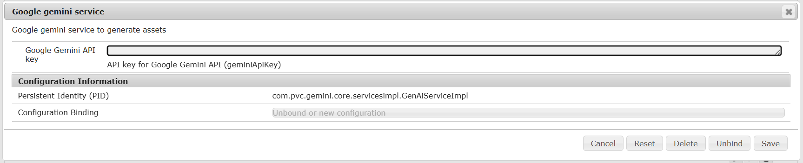

Project to add AEM and Google's Gemini API integration to generate and edit assets directly in AEM DAM using Google's Nano Banana API.

This project uses "gemini-2.5-flash-image" model for image generation purpose.

Feature:

To use this Google's API key need to be registered in ConfigMgr.

Please see demo here:
https://storage.googleapis.com/prateek_hub_bucket/AEM-Gemini.mp4

Contact me in case of any queries: pratchaudhari@gmail.com
